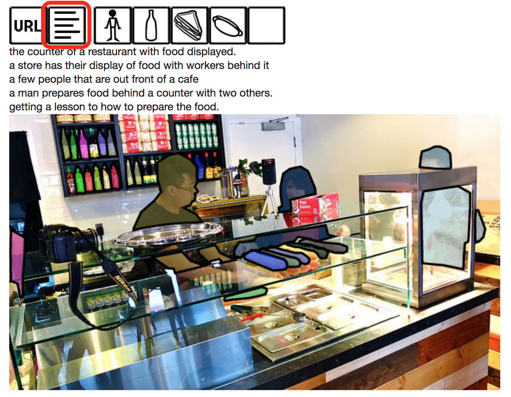
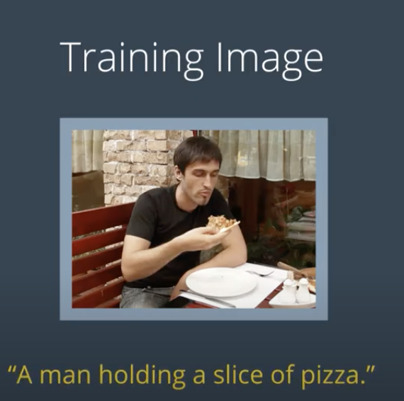
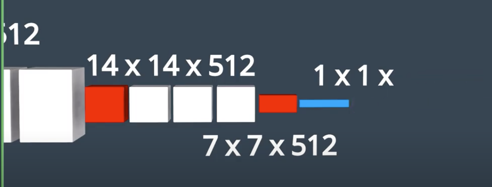
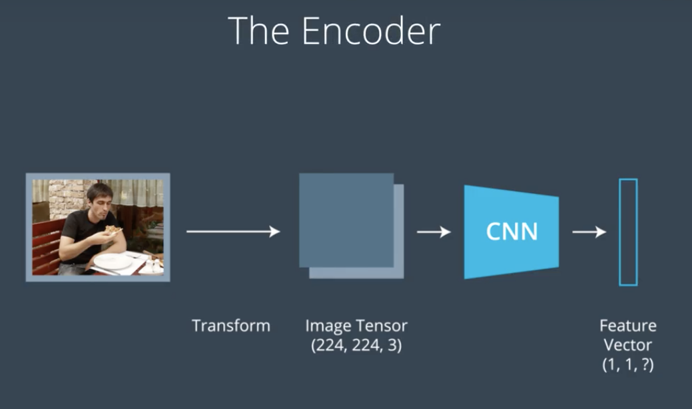
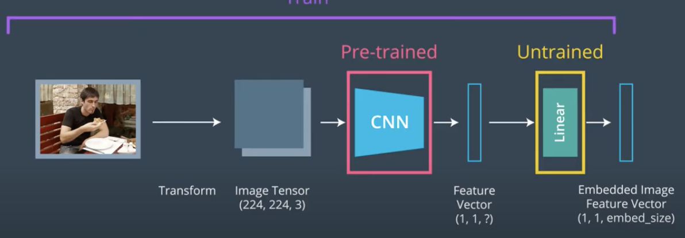
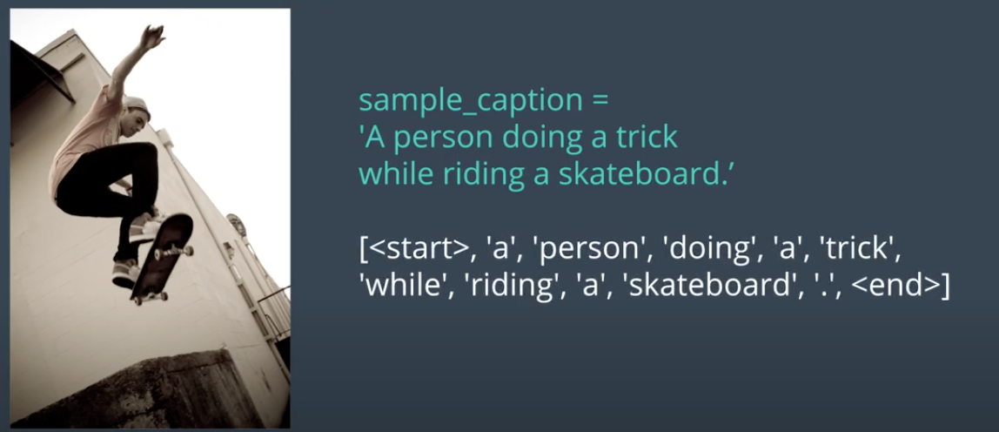
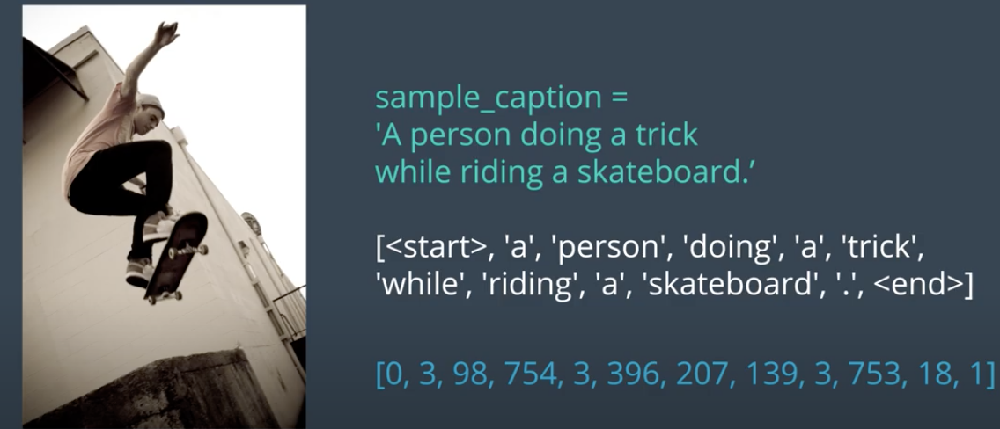

# My tweaks:
ResNet50 (20148 fc.in_features) + Bidirectional LSTM


# image-captioning-pytorch (orig readme)
Image Captioning using CNN+RNN Encoder-Decoder Architecture in PyTorch


Image Captioning Model

## Project Overview

In this project, you will create a neural network architecture to automatically generate captions from images. 

After using the Microsoft Common Objects in COntext [(MS COCO) dataset](http://cocodataset.org/#home) to train your network, you will test your network on novel images!

## COCO Dataset

The COCO dataset is one of the largest, publicly available image datasets and it is meant to represent realistic scenes. What I mean by this is that COCO does not overly pre-process images, instead these images come in a variety of shapes with a variety of objects and environment/lighting conditions that closely represent what you might get if you compiled images from many different cameras around the world.

To explore the dataset, you can check out the [dataset website](http://cocodataset.org/#explore)


### Captions

COCO is a richly labeled dataset; it comes with class labels, labels for segments of an image, *and* a set of captions for a given image. To see the captions for an image, select the text icon that is above the image in a toolbar. Click on the other options and see what the result is.




Example captions for an image of people at a sandwich counter.

When we actually train our model to generate captions, we'll be using these images as input and sampling *one* caption from a set of captions for each image to train on.

## CNN-RNN Model

Our model needs to take an image as input and output a text description of that image. The input image will be processed by CNN and will connect the output of the CNN to the input of the RNN which will allow us to generate descriptive texts. 



We feed the image into a CNN. Here we can use a pre-trained network like VGG16 or Resnet. 


At the end of these pre-trained networks we have a **softmax** classifier that outputs a vector of class scores. 


We do not plan to classify the image in our case, instead we want a set of features that represents the spatial content in the image. To get that kind of spatial information. We will remove the final fully connected layer that classifies the image and look at earlier layer that distills the spatial information in the image. 



Now we are using the CNN more like a feature extractor that compress huge amount of information contained in the original image into a smaller representation. 

This CNN is often called the **encoder** since it encodes the content of the image into a smaller feature vector 



Then we can process this feature vector and use it as an initial input to the following RNN. 

We take the feature vector, and process then inject it into the RNN as input. The Feature Vector acts as the glue between CNN and RNN.

It can sometimes prove useful to parse a CNN output through a additional fully-connected or linear layer before using it as an input to the RNN.


Recall the CNN we are using is pre-trained, then adding an untrained linear layer a the end of it allows us to tweak only the final layer as we train the entire model to generate captions. 



After we extract the feature vector from the CNN and process it, we can then use this as the initial input into our RNN. The the RNN will decode processed feature vector and turn into a natural language. This is the decoder portion. 

## Tokenizing Captions

The RNN component of the captioning network is trained on the captions in the COCO dataset. We will train the RNN to predict the next word of the sentence based on the previous words. Do this we will need to transform the captions associated with the image into a list of tokenized words. This tokenization turns any strings into a list of integers. 

Here are the steps:

1. Iterate through all of the training captions and create a dictionary that maps all unique words to a numerical index. Every word will have a corresponding integer value that we can find in this dictionary. These words are referred to as our vocabulary. 
2. The vocabulary typically also includes a few special tokens. Here we will add two special tokens to our dictionary to indicate the start and end of a sentence.
   1. <start> token
   2. <end> token
3. The entire vocabulary is the length of the number of unique words in our training dataset plus two for the start and end tokens. 

Example



The caption above is converted into a list of tokens with a special <start> and <end> token making the beginning and end of the sentence. 

This list of tokens is then turned into a list of integers which come from our dictionary that maps each distinct word in the vocabulary to an integer value. 



Before we can push this to the RNN as input, we need to add an Embedding Layer. The embedding layer transforms each word in a caption into a vector of desired consistent shape. After the embedding step, then we can start training the RNN. 

## Project Instructions

We use the encoder-decoder model which in this case it would be

* **Encoder**: Convolutional Features
  * For an image captioning system, we should use a trained architecture, such as ResNet or Inception, to extract features from the image. Like we did for the ensemble model, we can output a fixed vector length by using a linear layer and then make that linear layer trainable.
* **Decoder**: LSTM
  * A decoder is a **long short-term memory** (**LSTM**) layer that will generate a caption for an image. To build a simple model, we can just pass the encoder embedding as input to the LSTM. However, this could be quite challenging for the decoder to learn; instead, it is common practice to provide the encoder embedding at every step of the decoder. Intuitively, a decoder learns to generate a sequence of text that best describes the caption of a given image.

The project is structured as a series of Jupyter notebooks that are designed to be completed in sequential order:

# LSTM Decoder

In the project, we pass all our inputs as a sequence to an LSTM. A sequence looks like this: first a feature vector that is extracted from an input image, then a start word, then the next word, the next word, and so on! 

### Embedding Dimension

The LSTM is defined such that, as it sequentially looks at inputs, it expects that each individual input in a sequence is of a **consistent size** and so we *embed* the feature vector and each word so that they are `embed_size`.

### Sequential Inputs

So, an LSTM looks at inputs sequentially. In PyTorch, there are two ways to do this. 

The first is pretty intuitive: for all the inputs in a sequence, which in this case would be a feature from an image, a start word, the next word, the next word, and so on (until the end of a sequence/batch), you loop through each input like so:

```python
for i in inputs:
    # Step through the sequence one element at a time.
    # after each step, hidden contains the hidden state.
    out, hidden = lstm(i.view(1, 1, -1), hidden)
```

The second approach, which this project uses, is to **give the LSTM our \*entire sequence\*** and have it produce a set of outputs and the last hidden state:

```python
# the first value returned by LSTM is all of the hidden states throughout
# the sequence. the second is just the most recent hidden state

# Add the extra 2nd dimension
inputs = torch.cat(inputs).view(len(inputs), 1, -1)
hidden = (torch.randn(1, 1, 3), torch.randn(1, 1, 3))  # clean out hidden state
out, hidden = lstm(inputs, hidden)
```

# Research Papers

* [Show, Attend and Tell: Neural Image Caption Generation with Visual Attention](https://arxiv.org/pdf/1502.03044.pdf) [pdf]

* [Bottom-Up and Top-Down Attention for Image Captioning and Visual Question Answering](https://arxiv.org/pdf/1707.07998.pdf) [pdf]

* [Video Paragraph Captioning Using Hierarchical Recurrent Neural Networks](https://www.cv-foundation.org/openaccess/content_cvpr_2016/app/S19-04.pdf) [pdf]

* [Every Moment Counts: Dense Detailed Labeling of Actions in Complex Videos](https://arxiv.org/pdf/1507.05738.pdf) [pdf]

* [Tips and Tricks for Visual Question Answering: Learnings from the 2017 Challenge](https://arxiv.org/pdf/1708.02711.pdf) [pdf]

* [Visual Question Answering: A Survey of Methods and Datasets](https://arxiv.org/pdf/1607.05910.pdf) [pdf]

**Other Attention Methods**

Paper: [Attention Is All You Need](https://arxiv.org/abs/1706.03762)

Talk: [Attention is all you need attentional neural network models – Łukasz Kaiser](https://www.youtube.com/watch?v=rBCqOTEfxvg)

https://papers.nips.cc/paper/2019/file/680390c55bbd9ce416d1d69a9ab4760d-Paper.pdf

